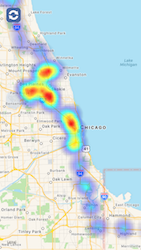

## GeoHeatMap

This is a sample app built in swift that saves your location while in background (and foreground) during significant location changes.  The locations are then displayed in a heat map using this [HeatMap](https://github.com/DingSoung/HeatMap) library.  The app badge will increment when a location is captured and saved to denote the background location update.  The badge will reset upon opening the app.

### Preview

### License

This project is available under the MIT license. See the LICENSE file for more info.
